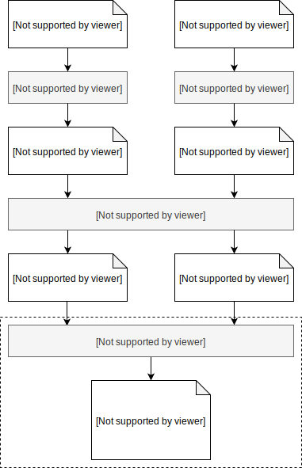
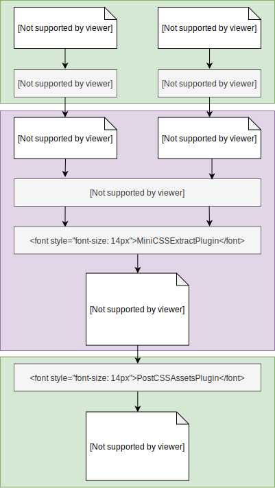

# Pre- and post-bundling processing

An attempt to explain different ways of combining [CSS Modules] with other CSS processing tools.

##### Table of contents:

1. [CSS Modules build process](#CSS-Modules-build-process)
2. [Processing opportunities](#Processing-opportunities)
3. [Implementation with webpack and PostCSS](#Implementation-with-webpack-and-PostCSS)

---

## CSS Modules build process

Files using CSS Modules syntax need to go through a few transformation steps before they become _browser-friendly_:

1. Compilation to ICSS
2. ICSS value resolution
3. CSS Bundling _(optional)_

### Compilation to ICSS

All input files with the _programmer-friendly_ syntax like `@value` or `composes` are compiled to [Interoperable CSS] \(ICSS).

### ICSS value resolution

All `:import` statements in ICSS are resolved and imported symbols usages are replaced in the file with the actual values.

### CSS bundling (optional)

In most common setups the resolved CSS modules are finally merged into a single CSS file (bundle).

<br />
<p align="center">
  
</p>

## Processing opportunities

Usually CSS Modules are not the only CSS transformation used in the project - many other processors can be used to enhance the styling capabilities even more.

The often overlooked opportunity is that **the additional processing can be done in any of the steps in the above chain.**

In particular 3 spots can be defined:

- before any CSS Modules transformations
- after value resolution
- after bundling

The important thing is - processing (even with the same tool) may bring different results depending on when it's applied. Some tools may work in any case, some may require to be run in a specific step.

### Example 1: `@each`

Any transformation that might result in changing the exported class names must happen before any CSS Modules processing (before compilation to ICSS).

This category contains all scripting extensions to CSS, like [postcss-each].

**Playground:** https://codesandbox.io/s/0mkrv3jrqn

#### Input

```pcss
@each $color in red, green, blue {
  .background-$(color) {
    background: $(color);
  }
}
```

#### Output (correct)

```css
._input_css_406__background-red {
  background: red;
}
._input_css_406__background-green {
  background: green;
}
._input_css_406__background-blue {
  background: blue;
}
:export {
  background-red: _input_css_406__background-red;
  background-green: _input_css_406__background-green;
  background-blue: _input_css_406__background-blue;
}
```

#### Output (incorrect)

Following ouput will be generated if the transformation of `@each` will happen on CSS already compiled to ICSS.

```css
._input_css_410__background-red {
  background: red;
}
._input_css_410__background-green {
  background: green;
}
._input_css_410__background-blue {
  background: blue;
}
:export {
  background-$(color): _input_css_410__background-$(color);
}
```

### Example 2: `calc`

Any transformation that relies on the imported values must be done after the value resolution.

Commonly used examples are [postcss-calc] and [postcss-color-function].

> **Note**: [postcss-modules-values-replace] was created specifically to solve this problem. It's a good, working solution, but it results in unnecessary duplication of the bundler/resolver logic.

#### Input

```pcss
/* sizes.css */
@value size_m: 8px;
```

```pcss
/* index.css */
@value size_m from './sizes.css';

.foo {
  width: calc(2 * size_m);
}
```

#### Output (correct)

```css
.foo {
  width: 16px;
}
```

#### Output (incorrect)

Following ouput will be generated if the transformation of `calc` will happen on unresolved ICSS values.

```css
.foo {
  width: calc(2 * 8px);
}
```

### Example 3: `@extend`

Some processors may require to be run not only after the value resolution, but on the bundled output.

Example: [postcss-modules-extend-rule].

## Implementation with webpack and PostCSS

CSS processing before and after bundling can be easily achieved with one of the most common setups: [webpack] + [PostCSS].

<p align="center">
  
</p>

### CSS Modules bundling

The CSS Modules resolution and bundling is done in webpack by combining [css-loader] and [MiniCssExtractPlugin]:

```js
// in webpack.config.js
{
 module: {
    rules: [
      {
        test: /\.css$/,
        use: [
          MiniCssExtractPlugin.loader,
          {
            loader: "css-loader",
            options: { modules: true }
          },
        ]
      }
    ]
  },
  plugins: [
    new MiniCssExtractPlugin({
      filename: "[name].css",
      chunkFilename: "[id].css"
    })
  ]
}
```

### Pre-bundling processing

The _input_ CSS files can be processed **before** the CSS Modules resolution and bundling by applying [postcss-loader] before the `css-loader`:

```js
// in webpack.config.js
{
 module: {
    rules: [
      {
        test: /\.css$/,
        use: [
          MiniCssExtractPlugin.loader,
          {
            loader: "css-loader",
            options: { modules: true }
          },
          {
            loader: "postcss-loader",
            options: { plugins: [/* anything you want */]}
          }
        ]
      }
    ]
  },
}
```

### Post-bundling processing

The _output_ CSS bundle can be processed **after** the CSS Modules bundling by using [PostCSSAssetsPlugin] after the `MiniCssExtractPlugin`:

```js
// in webpack.config.js
{
  plugins: [
    new MiniCssExtractPlugin({
      filename: '[name].css',
      chunkFilename: '[id].css',
    }),
    new PostCSSAssetsPlugin({
      test: /\.css$/,
      plugins: [
        /* anything you want */
      ],
    }),
  ];
}
```

A fully working example can be found in `postcss-modules-extend-rule` test [webpack.config.js][example-webpack-config]

<!-- links -->

[css modules]: https://github.com/css-modules/css-modules
[postcss-each]: https://github.com/outpunk/postcss-each
[postcss-calc]: https://github.com/postcss/postcss-calc
[postcss-color-function]: https://github.com/postcss/postcss-color-function
[postcss-modules-values-replace]: https://github.com/princed/postcss-modules-values-replace
[postcss-modules-extend-rule]: https://github.com/tomasz-sodzawiczny/postcss-modules-extend-rule
[interoperable css]: https://github.com/css-modules/icss
[webpack]: https://webpack.js.org/
[postcss]: https://postcss.org/
[css-loader]: https://github.com/webpack-contrib/css-loader
[minicssextractplugin]: https://github.com/webpack-contrib/mini-css-extract-plugin
[postcss-loader]: https://github.com/postcss/postcss-loader
[postcssassetsplugin]: https://github.com/klimashkin/postcss-assets-webpack-plugin
[example-webpack-config]: https://github.com/tomasz-sodzawiczny/postcss-modules-extend-rule/blob/dc07b5833313ce227ad674e821b6f79b20fbc01e/__test_project__/webpack.config.js
